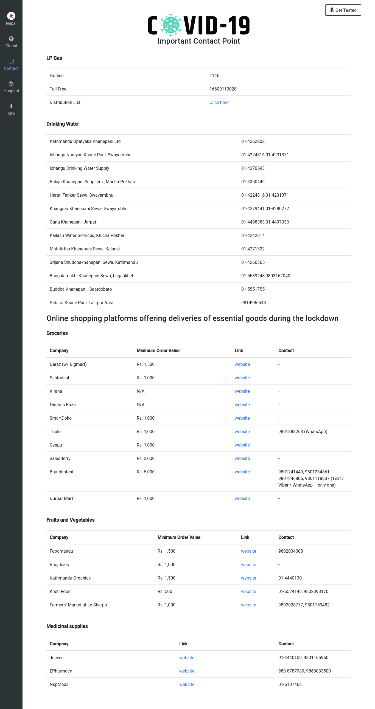

# COVID19 

  COVID-19 is a centralized system that help us to track the COVID report, list out the some important contact points, hospital data and symptoms, precaution measure to follow in this pendamic situations.  

#### Dashboard 

  The dashboard displays the information based on your location. It contains the confirmed, recovered, and deaths cases of your country initially. User can view the global report just below the graphical representation of the country wise data. User have option to select the country and explore the data. 

#### Nepal Statistics 

  This page is customised page for us to track the COIVD cases here in Nepal that displays all the statistics from the the government of Nepal. We have represented the COVID cases province and district wise in the section.

  Also, we filter the COVID related news from different portal. 

  The list of important contact points, links and the information about COVID-19. 

#### Screenshots

#### API Used 
- https://covid19.mathdro.id/api
- https://ipapi.co/json
- https://nepalcorona.info/api/v1

#### Clone the Project 
- https://github.com/aakritsubedi/covid19
    - `git clone git@github.com:aakritsubedi/covid19.git`
    - Change directory to the project folder
    - `yarn` || `npm install`
    - `yarn serve` || `npm run serve`:
      - App running at:
        Local:   http://localhost:8080 

#### Contributors
- AAkrit Subedi
  - https://github.com/aakritsubedi
  - aakritsubedi9@gmail.com
- Samir Silwal
  - https://github.com/samirsilwal
  - samirsilwal2424@gmail.com
- Manjil Nepali 
  - https://github.com/monzilnepali
  - manjilnepali98@gmail.com